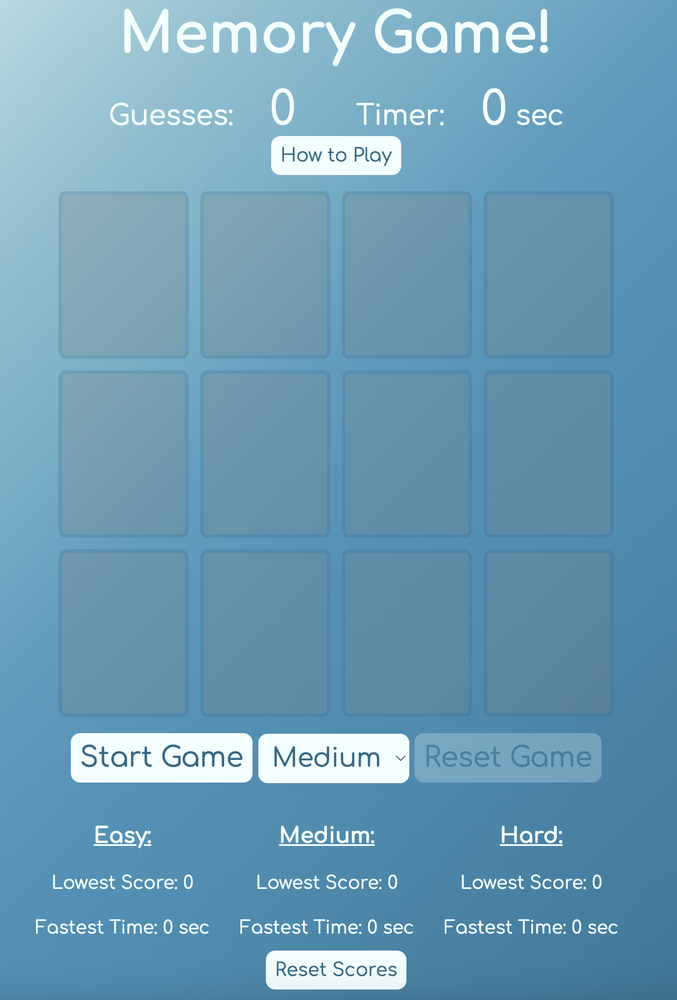

# Memory Game

A card-based memory game built with Vanilla Javascript, HTML, and CSS

### Features
- Able to choose different difficulty levels
- Keeps track of lowest score and fastest time
- Sound effects for each match and when game ends

## Tech Stack

JavaScript, HTML, CSS

## Lessons Learned

A good exercise in thinking logically about the flow of a game. Having to keep track of when and what cards were clicked as well as thinking of every possible edge case that could break the game was challenging but fun to figure out.
## Screenshots

